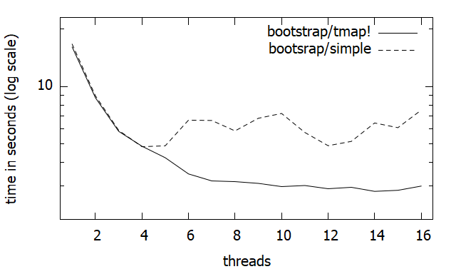
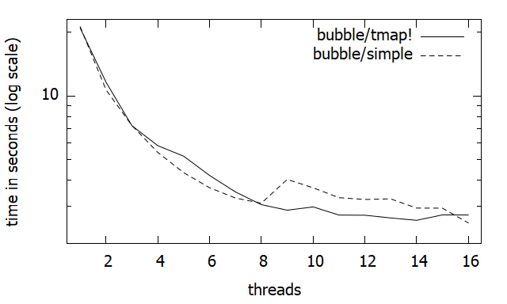

# KissThreading.jl

This package is WIP and not fully tested. Use with care (`tmap!` should be safe to use).

Simple patterns supporting working with threads in Julia. Functionalities:
* `tmap!`, `tmapreduce`, `tmapadd` functions. They are designed for relatively expensive mapping `f`;
* `trandjump` and `TRNG` are for random number generators ready for threading
* `getrange` is a function returning a range of indices to traverse in a given thread
  it is designed for cases when we handcode loop inside `@threads` macro
  (usually when mapping `f` is cheap and e.g. can benefit from `@simd`)

Comparison of performance `tmap!` threading with copied random number generators and standard `@Threading.threads`.
Tests run on 16 core AWS c4.4xlarge instance by running *src/runtests.sh*.
We measure time using `@time` so `tmap!` has more of precompilation overhead reported.

### `bootstrap.jl`

### `bubble.jl`

